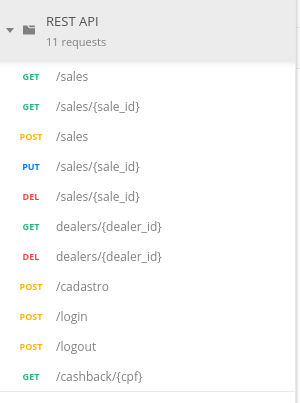

# API RESTFUL FLASK

Projeto de API RESTFUL desenvolvido em Python 3.7.5

### Tecnologias Utilizadas:

 - Flask
 - Docker 
 - SQLite3
 - SQLAlchemy 
 - Autenticação JWT
 - UnitTest

 
 
### Pré-requisitos:
- Ambiente Linux 
- Python 3.7.5
- Docker

### Iniciar o Projeto :
 - No diretório raiz, rode o comando para buildar o docker:

    `docker-compose up --build` 
 

 - ou utilize o virtualenv:

    `pip install virtualenv`

    `virtualenv venv --python=python3.7`

    `source venv/bin/activate`

    `alias python=python3.7`

    `python -m pip install -r requirements.txt`

    `python run.py`

 
   

## Testes:

#### Iniciar:
   
   `alias python=python3.7`

   `python -m pip install -r requirements.txt`
  
 
 - Testes de cadastro de Revendedores: 
    <blockquote>python -m unittest tests/test_cadastro_api.py

 - Testes de GET e DELETE de Revendedores: 
     <blockquote>python -m unittest tests/test_dealers_api.py

 - Testes de CRUD de Compras: 
     <blockquote>python -m unittest tests/test_sales_api.py

 - Testes de Login e Logout: 
     <blockquote>python -m unittest tests/test_login_logout_api.py

 - Testes de Cashback: 
     <blockquote>python -m unittest tests/test_cashback_api.py

 
 - ALL TESTS: 
     <blockquote>python -m unittest -v tests
  

## Rotas
* [Json Postman](rest_api.postman.json) - use para importar no Postman.

## Route: /sales

#### LISTAR TODAS COMPRAS
##### Retorna uma lista com todas as compras cadastradas.

- Endpoint: /sales
- Método: GET 
- Retorno: JSON 
- Authorization JWT: False

Header:

    {
      "Content-Type": "application/json"
    }

Body:

    {}

---------

#### LISTAR COMPRA ESPECÍFICA
##### Retorna uma compra através do ID passado na URL.

- Endpoint: /sales/{sale_id}
- Método: GET 
- Retorno: JSON 
- Authorization JWT: False

Header:

    {
      "Content-Type": "application/json"
    }

Body:

    {}

---------

#### CADASTRAR COMPRA
##### Cadastra uma nova compra.

- Endpoint: /sales
- Método: POST 
- Retorno: JSON 
- Authorization JWT: True
 
Header:

    {
      "Content-Type": "application/json",
      "Authorization": "Bearer <token gerado no login>"
    }

Body:

    {
        "codigo": "<string>",
        "valor": <decimal com ponto>,
        "data": "<Y-m-d>",
        "cpf": "<somente números>"
    }
    

---------

#### ALTERAR COMPRA
##### Altera dados de um compra através do ID passado na URL.
- Endpoint: /sales/{sale_id}
- Método: PUT 
- Retorno: JSON 
- Authorization JWT: True

Header:

    {
      "Content-Type": "application/json",
      "Authorization": "Bearer <token gerado no login>"
    }

Body:

    {
        "codigo": "<string>",
        "valor": <decimal com ponto>,
        "data": "<Y-m-d>",
        "cpf": "<somente números>",
        "status": "<string>" (opcional)
    }
    
---------

#### DELETAR COMPRA
##### Remove uma compra através do ID passado na URL.
- Endpoint: /sales/{sale_id}
- Método: DELETE 
- Retorno: JSON 
- Authorization JWT: True
 
Header:

    {
      "Content-Type": "application/json",
      "Authorization": "Bearer <token gerado no login>"
    }

Body:

    {}
    

---------

## Route: /dealers

#### LISTAR REVENDEDOR ESPECÍFICO
##### Retorna um revendedor através do ID passado na URL.

- Endpoint: /dealers/{dealer_id}
- Método: GET 
- Retorno: JSON 
- Authorization JWT: True

Header:

    {
      "Content-Type": "application/json"
      "Authorization": "Bearer <token gerado no login>"
    }

Body:

    {}

---------

#### DELETAR REVENDEDOR
##### Remove um revendedor através do ID passado na URL.

- Endpoint: /dealers/{dealer_id}
- Método: DELETE 
- Retorno: JSON 
- Authorization JWT: True

Header:

    {
      "Content-Type": "application/json"
      "Authorization": "Bearer <token gerado no login>"
    }

Body:

    {}

---------

## Route: /cadastro

#### CADASTRAR REVENDEDOR
##### Cadastra um novo revendedor.

- Endpoint: /cadastro
- Método: POST 
- Retorno: JSON 
- Authorization JWT: True

Header:

    {
      "Content-Type": "application/json"
      "Authorization": "Bearer <token gerado no login>"
    }

Body:

    {
        "email": "<string>",
        "senha": "<string>",
        "nome_completo": "<string>",
        "cpf": "<somente números>"
    }

---------

## Route: /login

#### LOGIN
##### Realiza um login e retorna um token JWT.

- Endpoint: /login
- Método: POST 
- Retorno: JSON 
- Authorization JWT: False

Header:

    {
      "Content-Type": "application/json"
    }

Body:

    {
        "email": "<string>",
        "senha": "<string>"
    }

---------

## Route: /logout

#### LOGOUT
##### Realiza um logout inserindo o token JWT em uma blacklist.

- Endpoint: /logout
- Método: POST 
- Retorno: JSON 
- Authorization JWT: True

Header:

    {
      "Content-Type": "application/json"
      "Authorization": "Bearer <token gerado no login>"
    }

Body:

    {}

---------

## Route: /cashback

#### CASHBACK
##### Retorna valor acumulado do cashback de uma API, através do CPF informado.

- Endpoint: /cashback/{cpf}
- Método: GET 
- Retorno: JSON 
- Authorization JWT: False

Header:

    {
      "Content-Type": "application/json"
      "Token": "<token informado pelo cliente>"
    }

Body:

    {}
